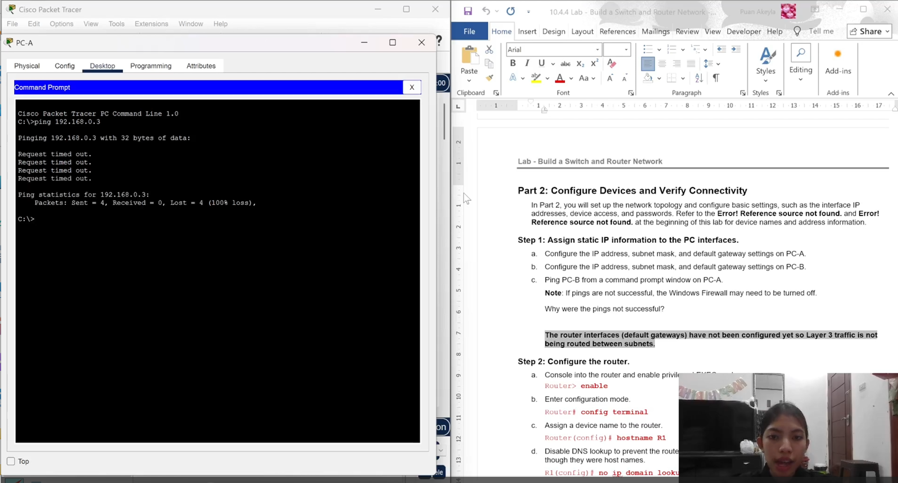
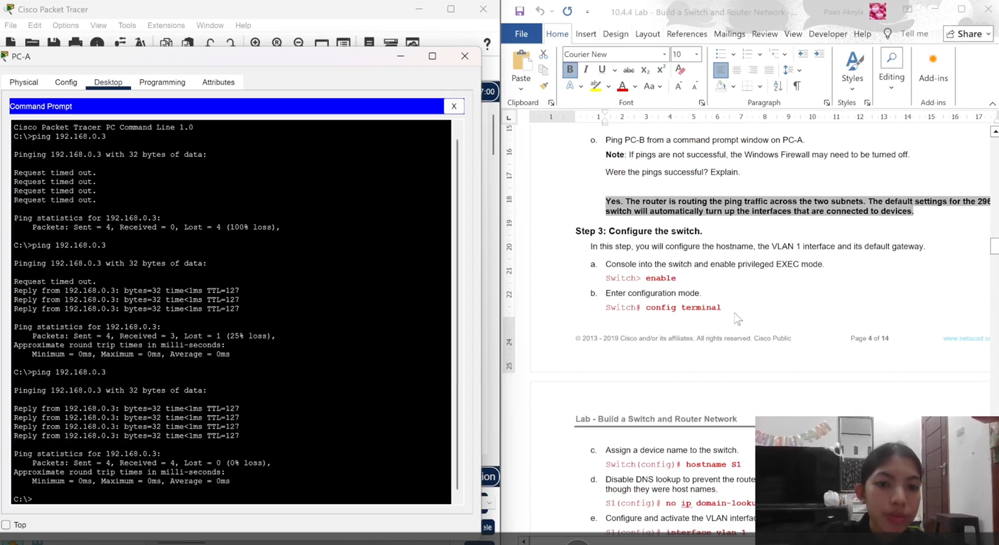

# Tugas Akhir 2 - Praktikum Jaringan Komputer
Repositori ini berisi file tugas akhir kedua untuk mata kuliah **Praktikum Jaringan Komputer**.  
File utama berisi konfigurasi jaringan menggunakan **Cisco Packet Tracer**, serta hasil pengujian konektivitas melalui perintah `ping`.

## File
- **Puan Akeyla Maharani M_2315061070_TA2_JKD.pkt** — File utama berisi konfigurasi jaringan menggunakan Cisco Packet Tracer.  
- **pingBelumBerhasil.png** — Hasil tangkapan layar ketika koneksi jaringan belum berhasil.  
- **pingSudahBerhasil.png** — Hasil tangkapan layar setelah koneksi berhasil dilakukan.  

## Tujuan
- Menghubungkan dua subnet menggunakan router.
- Mengonfigurasi switch dan router agar dapat saling berkomunikasi.
- Menguji konektivitas antar perangkat (PC-A ↔ PC-B).
- Menampilkan informasi jaringan dengan perintah `show`.

## Deskripsi 
Proyek ini membangun topologi jaringan dasar menggunakan:
- 1 Router **Cisco 4221**
- 1 Switch **Cisco 2960**
- 2 PC (PC-A & PC-B)

Konfigurasi meliputi IP address, pengamanan login, aktivasi interface, dan pengujian konektivitas IPv4 & IPv6.

## Peralatan
- Router Cisco 4321  
- Switch Cisco 2960  
- 2 PC  
- Kabel console & Ethernet  
- Aplikasi terminal (Tera Term / PuTTY)

## Tabel Alamat

| Device | Interface | IPv4 Address | Subnet Mask | IPv6 Address | Default Gateway |
|--------|------------|--------------|--------------|---------------|-----------------|
| R1 | G0/0/0 | 192.168.0.1 | /24 | 2001:db8:acad::1/64 | — |
| R1 | G0/0/1 | 192.168.1.1 | /24 | 2001:db8:acad:1::1/64 | — |
| S1 | VLAN 1 | 192.168.1.2 | /24 | — | 192.168.1.1 |
| PC-A | NIC | 192.168.1.3 | /24 | 2001:db8:acad:1::3/64 | 192.168.1.1 |
| PC-B | NIC | 192.168.0.3 | /24 | 2001:db8:acad::3/64 | 192.168.0.1 |


##  Langkah-Langkah Konfigurasi

###  1. Inisialisasi & Koneksi
1. Hubungkan perangkat sesuai topologi:
   - PC-A → Switch → Router (G0/0/1)
   - PC-B → Router (G0/0/0)
2. Nyalakan semua perangkat.
3. Hapus konfigurasi lama:
   ```bash
   erase startup-config
   reload

###  2. Konfigurasi Router
Router> enable
Router# config terminal
Router(config)# hostname R1
R1(config)# no ip domain-lookup
R1(config)# enable secret class
R1(config)# service password-encryption
R1(config)# banner motd $ Authorized Users Only! $

! Console dan Telnet login
R1(config)# line console 0
R1(config-line)# password cisco
R1(config-line)# login
R1(config-line)# exit

R1(config)# line vty 0 4
R1(config-line)# password cisco
R1(config-line)# login
R1(config-line)# exit

! Interface G0/0/0 (ke PC-B)
R1(config)# interface g0/0/0
R1(config-if)# ip address 192.168.0.1 255.255.255.0
R1(config-if)# ipv6 address 2001:db8:acad::1/64
R1(config-if)# ipv6 address fe80::1 link-local
R1(config-if)# description Connected to PC-B
R1(config-if)# no shutdown
R1(config-if)# exit

! Interface G0/0/1 (ke Switch)
R1(config)# interface g0/0/1
R1(config-if)# ip address 192.168.1.1 255.255.255.0
R1(config-if)# ipv6 address 2001:db8:acad:1::1/64
R1(config-if)# ipv6 address fe80::1 link-local
R1(config-if)# description Connected to Switch S1
R1(config-if)# no shutdown
R1(config-if)# exit

! Aktifkan routing IPv6
R1(config)# ipv6 unicast-routing
R1(config)# exit

! Simpan konfigurasi & atur jam
R1# copy running-config startup-config
R1# clock set 15:30:00 27 Aug 2019

###  3. Konfigurasi Switch
Switch> enable
Switch# config terminal
Switch(config)# hostname S1
S1(config)# no ip domain-lookup

! IP VLAN untuk manajemen
S1(config)# interface vlan 1
S1(config-if)# ip address 192.168.1.2 255.255.255.0
S1(config-if)# no shutdown
S1(config-if)# exit

! Default gateway
S1(config)# ip default-gateway 192.168.1.1
S1(config)# exit

! Simpan konfigurasi
S1# copy running-config startup-config

###  4. Konfigurasi PC
PC-A: 
IPv4: 192.168.1.3
Subnet Mask: 255.255.255.0
Gateway: 192.168.1.1

PC-B:
IPv4: 192.168.0.3
Subnet Mask: 255.255.255.0
Gateway: 192.168.0.1

###  5. Pengujian Konektivitas
Dari Pc-A: ping 192.168.0.3
Dari Switch : ping 192.168.0.3

###  6. Perintah Verifikasi Penting
R1# show ip route
R1# show ipv6 route
R1# show ip interface brief
R1# show ipv6 interface brief
S1# show ip interface brief

## Hasil Pengujian
Sebelum koneksi berhasil:


Setelah koneksi berhasil:


## Penjelasan Lebih Lanjut
Penjelasan lebih lengkap mengenai isi dan konfigurasi jaringan dapat dilihat pada video berikut:  
🎥 [Klik di sini untuk menonton di YouTube](https://youtu.be/EF5bNltfH4g)
